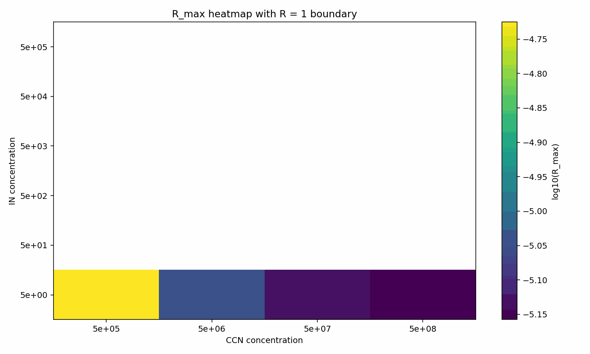

# 🌥️ Python Cloud Parcel Model
A physically-based cloud parcel model revealing vapour competition between liquid droplets and ice crystals.
⚠️ Research-grade prototype for physical insight, not operational forecasting.

# 🚀 What this project does
This model simulates the ascent of an air parcel and shows how:

- **cloud droplets form (Köhler activation)**
- **ice crystals nucleate (biological IN)**
- **vapour is shared between liquid and ice**
- **mixed-phase clouds emerge naturally**

## 🎬 Model Visualisations
### Vapour competition (R vs time)
  
  Evolution of vapour competition showing transition from liquid to ice-dominated regime.

  
  This figure shows the maximum vapour competition across CCN-IN conditions.

Transition from liquid-dominated to ice-dominated regime:
- **R < 1 → liquid-dominated**
- **R ≥ 1 → ice-dominated**

### Parameter space exploration (CCN–IN)
Heatmap of maximum vapour competition across aerosol parameter space.
The white boundary indicates the transition to an ice-dominated regime **(R ≥ 1)**.

---

This repository provides a physically interpretable framework for studying aerosol–cloud–ice interactions in a controlled parcel environment.
It focuses on the emergence of mixed-phase microphysical processes from first-principles thermodynamics, rather than parameterised large-scale modelling.
A physically based **cloud parcel model** implemented in Python to investigate aerosol activation, vapour competition, and mixed-phase cloud microphysics.
The model is designed as a **transparent research framework** to explore how aerosol populations, liquid droplets, and ice crystals interact during the ascent of an air parcel.

---

## 🧠 Key Insight

Ice does not dominate automatically.

👉 Ice-dominated behaviour **(R ≥ 1)** only appears when:
- ice nucleation is strong enough
- vapour competition becomes significant
  
This provides a physical explanation of the Bergeron–Findeisen process.

---

## Scientific Context

Mixed-phase clouds remain a major source of uncertainty in atmospheric science and climate modelling.
Key unresolved processes include:

- aerosol–cloud interactions  
- biological ice nucleation  
- vapour competition between droplets and ice  
- sensitivity to updraft velocity  

Parcel models provide a controlled framework to isolate these processes while maintaining physically consistent thermodynamics.
This repository implements a **minimal but physically interpretable parcel model** that allows these interactions to emerge naturally.

---

## Physical Framework

These processes are represented mathematically in the governing equations below.
The parcel model simulates the ascent of an air parcel with prescribed updraft velocity.
Key physical components include:

- **Aerosol Activation**
Cloud droplet formation follows **Köhler theory**, allowing aerosols to activate when supersaturation exceeds the critical value.

- **Biological Ice Nucleation**
Ice nucleation is represented through a temperature-dependent biological IN parameterisation based on a logistic activation curve.

---

## Governing Equations

The parcel model is based on a physically consistent representation of vapour, liquid, and ice interactions in a rising air parcel.

- **Supersaturation**

Supersaturation is defined separately with respect to liquid water and ice:
```
Sw = (e − esat_water) / esat_water  
Si = (e − esat_ice) / esat_ice
```

This separation allows liquid droplets and ice crystals to interact with the vapour field under distinct thermodynamic constraints.

- **Vapour Budget**

The total vapour tendency is decomposed into contributions from liquid condensation and ice deposition:
```
dqv/dt = (dqv/dt)_liq + (dqv/dt)_ice
``` 

where:

(dqv/dt)_liq = − cond_rate  
(dqv/dt)_ice = − dep_rate  

This formulation enables explicit competition between liquid droplets and ice particles for available water vapour.

- **Temperature Evolution**

Temperature evolves due to adiabatic cooling and latent heat release:
```
dT/dt = − cooling_rate + (Lv / cp) · (dql/dt) + (Ls / cp) · (dqi/dt)
```
This coupling ensures thermodynamic consistency between microphysical growth and parcel evolution.

- **Ice-Dominance Diagnostic**

To quantify vapour competition, a diagnostic ratio is defined:
```
R = |dep_rate| / |cond_rate|
```
R < 1 → liquid-dominated regime  
R ≥ 1 → ice-dominated regime  

This diagnostic provides a quantitative measure of the transition to ice-dominated vapour depletion, consistent with the Bergeron–Findeisen process.

- **Maxwell-Type Growth**

Droplet and ice growth follow Maxwell-type diffusion-limited growth equations:
```
 dr/dt = (G / r) S
```

where **G(T)** represents the combined effects of vapour diffusion and latent heat transport.

- **Latent Heat Feedback**

Condensation and deposition release latent heat, modifying parcel temperature through:
```
dT/dt = − cooling_rate + latent_heating
```

This ensures thermodynamic consistency between microphysics and parcel evolution.

---

## 📊 Core Diagnostic

The key quantity is:
```
 R = |dep_rate| / |cond_rate|
```
Interpretation:

| Regime | Meaning |
|--------|-----------|
| R < 1 | Liquid dominates |
| R ≥ 1| Ice dominates |

This provides a quantitative diagnostic for the onset of the **Bergeron–Findeisen process**.
Under baseline aerosol and IN conditions, condensation remains the dominant vapour sink (**R < 1**).
Sensitivity experiments demonstrate that:

- increasing IN number  
- decreasing CCN concentration  
- increasing updraft velocity  

can significantly increase **R**, strengthening vapour competition between droplets and ice.

---

## Model Diagnostics

These diagnostics illustrate the competition between liquid droplets and ice crystals for available water vapour within the parcel.

In particular, the evolution of the diagnostic ratio \(R = |dep\_rate| / |cond\_rate|\) highlights the transition towards an ice-dominated regime, consistent with the Bergeron–Findeisen process.

Together, these results demonstrate that mixed-phase interactions emerge naturally from physically based thermodynamics and diffusion-limited growth.

---

### Supersaturation evolution

 

Supersaturation with respect to liquid water (Sw) and ice (Si) evolves differently as the parcel cools.  
Following droplet activation, Sw approaches a quasi-steady state due to condensation, while Si continues to increase because the saturation vapour pressure over ice is lower than over liquid water.

---

### Thermodynamic driver (Si − Sw)

 

The difference between supersaturation with respect to ice and liquid water (Si − Sw) highlights the fundamental thermodynamic driver of the Bergeron–Findeisen process.As temperature decreases, Si exceeds Sw, favouring vapour deposition onto ice crystals.

---

### Liquid and ice mass evolution

 

The evolution of liquid water mass (qcloud) and ice mass (qice) reflects the partitioning of water substance within the parcel.  
Liquid water increases rapidly following activation, while ice mass grows more gradually through vapour deposition after nucleation.

---

### Vapour competition (R vs time)

 

The diagnostic ratio \(R = |dep\_rate| / |cond\_rate|\) quantifies vapour competition between ice deposition and liquid condensation.  
When \(R < 1\), condensation dominates vapour removal.  
When \(R \geq 1\), vapour depletion becomes dominated by ice deposition, indicating the onset of Bergeron–Findeisen conditions.

---

### Sensitivity of the ice-dominated transition

To examine the conditions under which the parcel transitions from a liquid-dominated to an ice-dominated vapour sink, a sensitivity analysis was performed by varying cloud condensation nuclei (CCN) concentration and ice-nucleating particle (IN) concentration.

The figure below shows the maximum value of the dominance ratio

R = |dep_rate| / |cond_rate|

reached during each simulation.

Regions where R < 1 remain liquid-dominated, while regions where R ≥ 1 indicate a transition to an ice-dominated vapour sink consistent with the Bergeron–Findeisen process.


*Figure: Heatmap of the maximum dominance ratio \(R_{max}\) across CCN and IN concentration. The colour scale shows \(\log_{10}(R_{max})\). Regions marked \(R \geq 1\) indicate simulations in which vapour deposition onto ice exceeds condensation onto liquid droplets, corresponding to an ice-dominated regime.*

The results show that the transition to an ice-dominated regime occurs only when IN concentration is sufficiently high. At low IN concentration, condensation onto liquid droplets remains the dominant vapour sink even when CCN concentration is reduced. This demonstrates that the Bergeron–Findeisen transition depends strongly on the balance between aerosol loading and ice-nucleating particle availability.

---

### Sensitivity of the ice-dominated regime


*Figure: Heatmap of the maximum dominance ratio (R_max) across CCN and IN concentrations. The colour scale shows log10(R_max). The white contour line represents the transition boundary (R = 1), separating liquid-dominated (R < 1) from ice-dominated (R ≥ 1) vapour depletion regimes. The results show that the Bergeron–Findeisen process emerges only when ice-nucleating particle concentration exceeds a critical threshold.*

---

## Results

**Vapour competition and emergence of mixed-phase behaviour**

The model captures the competition between liquid condensation and ice deposition through the diagnostic ratio:

R = |dep_rate| / |cond_rate|

During parcel ascent, condensation initially dominates vapour removal following droplet activation. As temperature decreases and ice nucleation occurs, vapour deposition onto ice crystals increases. In some cases, this leads to a transition where ice becomes the dominant vapour sink (R ≥ 1), consistent with the Bergeron–Findeisen process.

**Thermodynamic driver of the Bergeron–Findeisen process**

The difference between supersaturation with respect to ice and liquid water (Si − Sw) provides a thermodynamic explanation for this transition. As temperature decreases, Si increasingly exceeds Sw, creating a vapour pressure gradient that favours deposition onto ice over condensation onto liquid droplets.

**Evolution of liquid and ice mass**

Following activation, liquid water mass increases rapidly due to condensation. Ice mass grows more gradually after nucleation, but can become increasingly important as vapour competition strengthens.

**Transition to ice-dominated vapour depletion**

The diagnostic ratio R shows the transition from liquid-dominated (R < 1) to ice-dominated (R ≥ 1) vapour depletion. This transition marks the onset of Bergeron–Findeisen conditions within the parcel.

**Sensitivity of the ice-dominated transition**

To identify the conditions under which this transition occurs, a sensitivity analysis was performed across CCN and IN concentrations.
The results show that the transition to an ice-dominated regime occurs only when IN concentration is sufficiently high. At low IN concentration, condensation remains the dominant vapour sink regardless of CCN concentration. This demonstrates that the Bergeron–Findeisen process emerges only within a specific region of CCN–IN parameter space.

These results are enabled by the use of Maxwell-type diffusion-limited growth, which provides a physically consistent representation of droplet evolution.

---
# 🎬 Model Validation Results

## Case 1 — Warm-Rain Benchmark (KiD-inspired)

To evaluate the physical consistency of the parcel model, a warm-rain benchmark inspired by KiD Case 1 has been implemented.

This configuration includes:

- prescribed sinusoidal updraught forcing  
- fixed temperature  
- Köhler-based aerosol activation  
- supersaturation over water from thermodynamic calculations  
- Maxwell-type droplet growth  
- warm-rain autoconversion and accretion  

### Results

  
*Cloud water mass evolution.*

  
*Rain water mass evolution.*

  
*Surface rain-rate evolution.*

  
*Liquid water path evolution.*

The model reproduces the expected qualitative behaviour of a warm-rain cloud system:

- rapid cloud water growth during ascent  
- peak cloud water followed by decay  
- delayed rain formation  
- gradual increase in surface rain rate  

### Validation Metrics

| Metric | Value |
|--------|------|
| Max cloud mass | 1.35 × 10⁻³ |
| Time of max cloud | 296 s |
| Max rain mass | 1.40 × 10⁻³ |
| Rain onset time | 42 s |
| Max rain rate | 6.99 × 10⁻³ |
| Final cloud mass | ~0 |
| Final rain mass | 1.40 × 10⁻³ |

### Interpretation

The model captures the essential warm-rain evolution:

- rapid cloud development followed by depletion  
- conversion of cloud water into rain  
- rain dominance at late times  

These results are consistent with KiD intercomparison behaviour.

---

## Case 2 — Mixed-Phase Cloud (Maxwell Growth)

A mixed-phase parcel experiment was performed using the Maxwell-growth framework, including:

- coupled vapour evolution  
- latent heating  
- biological ice nucleation  

This setup represents a system where liquid droplets and ice crystals compete for water vapour.

### Results

  
*Evolution of liquid water and ice mass.*

  
*Supersaturation over water (Sw) and ice (Si).*

  
*Condensation vs deposition sinks.*

  
*Bergeron–Findeisen ratio.*

---

### Physical Interpretation

The simulation shows coexistence of liquid and ice:

- supersaturation over ice (Si) > supersaturation over water (Sw)  
- liquid grows rapidly after activation  
- ice increases steadily via deposition  
- condensation and deposition occur simultaneously  

Ice growth is favoured because saturation vapour pressure over ice is lower than over liquid water.

---

### Bergeron–Findeisen Transition

The model captures a transition from:

- liquid-dominated regime (R < 1)  
- to ice-dominated regime (R ≥ 1)  

This transition emerges naturally without parameter tuning.

- transition time ≈ 1800 s  
- final ratio R ≈ 11.57  

As temperature decreases:

- saturation over ice becomes lower  
- vapour deposits onto ice  
- droplet growth reduces Sw  

---

### Validation Metrics

| Metric | Value |
|--------|-------|
| Max liquid mass (qcloud) | 1.95 × 10⁻³ |
| Max ice mass (qice) | 1.18 × 10⁻³ |
| Ice onset time | 0 s |
| Max Sw | 1.14 × 10⁻² |
| Max Si | 3.83 × 10⁻¹ |
| Max condensation sink | 1.72 × 10⁻⁶ |
| Max deposition sink | 4.29 × 10⁻⁷ |
| Final R | 11.57 |

---

### Note

An initial spike in the ratio R may occur due to very small condensation rates.  
This is a numerical artefact and does not affect interpretation.

---

### Key Insights

- mixed-phase behaviour emerges naturally from thermodynamics  
- vapour competition depends on Si vs Sw  
- ice growth can occur even when condensation dominates  

---

## Final Scientific Conclusion

This model demonstrates that:

- mixed-phase cloud behaviour emerges from physical principles  
- vapour competition is controlled by Si and Sw  
- ice growth is thermodynamically favoured at lower temperatures  
- transition to ice-dominated regimes does not require tuning  

The model provides a consistent bridge between:

warm-rain microphysics → mixed-phase processes → ice-dominated regimes
---

## Numerical Stability Analysis

### Stability Test Summary
The model was tested across:

- Updraft velocities: 1, 5, 10 m/s  
- Timesteps: 0.1, 0.5, 1.0 s  
- Initial ice radii: 1e-6, 5e-7, 1e-7 m  

A total of 27 combinations were evaluated.
All cases remained numerically stable. No NaN values, infinite values, negative radii, or supersaturation blow-up were observed.

---

### Representative Cases

| w (m/s) | dt (s) | r_init (m) | Status | Notes                  |
|--------|--------|-----------|--------|------------------------|
| 1      | 1.0    | 1e-6      | Stable | No onset               |
| 5      | 0.5    | 5e-7      | Stable | Normal growth          |
| 10     | 0.1    | 1e-7      | Stable | Extreme but stable     |

---

### Detailed Analysis

To further investigate the effect of timestep size, additional simulations were performed using larger timestep values (dt = 2, 5, and 10 s).

All simulations remained numerically stable, with no evidence of divergence, oscillations, or instability.

---

### Stability Behaviour

- No oscillations or numerical blow-up were detected.  
- Ice growth remained physically consistent across all simulations.  
- The onset of ice formation occurred at similar times for different timestep values.  

---

### Accuracy Considerations

While the model remains stable for large timesteps, small differences in the final ice radius were observed:

- Smaller timesteps (dt ≤ 0.1) produce nearly identical results.  
- Larger timesteps (dt ≥ 1.0) introduce slight deviations.  

This indicates that:

- The model is numerically stable across a wide range of dt.  
- The solution is converging as dt → 0.  
- Larger timesteps slightly reduce accuracy but do not affect overall behaviour.  

---

### Practical Implications

These results suggest that:

- The model can be run with relatively large timesteps to reduce computational cost.  
- A timestep of dt ≈ 0.1–1.0 s provides a good balance between accuracy and efficiency.  

### Sensitivity to Timestep (dt)

  
The figure below shows the variation of the final ice radius as a function of timestep size.

This plot confirms that:

- The solution converges as dt decreases.
- The variation in final ice radius remains small.
- The model remains stable across the tested timestep range.
  
### Interpretation

The results show that the final ice radius converges as the timestep decreases.

For timesteps larger than 1 s, the solution becomes nearly constant, indicating numerical stability and low sensitivity to further increases in timestep.

This suggests that using dt ≈ 1 s provides a good compromise between computational efficiency and accuracy.

---

### Breakdown at large timesteps

To further investigate the robustness of the model, larger timestep values were tested (dt = 20, 50, and 100 s).

The simulations failed for these cases:

- dt = 20 s → Overflow error
- dt = 50 s → Division by zero
- dt = 100 s → Division by zero

This indicates that the numerical scheme becomes unstable for sufficiently large timesteps. The failure is likely due to large temperature changes within a single timestep, leading to non-physical values and numerical breakdown.

Therefore, while the model is stable for dt ≤ 10 s, there is a clear upper limit beyond which the results are no longer reliable.

---

### Reproducibility

All results can be reproduced by running:

```bash
python run_stability_test.py

```
The output summary is saved in:

```bash
data/stability_results.csv

```

---

## Repository Structure

The project is organised to clearly separate model physics, experiments, diagnostics, and outputs.

```text
python-cloud-model/
├── parcel_model/         # core model components
│   ├── aerosol.py         # aerosol population definitions
│   ├── activation.py       # Köhler-based activation
│   ├── thermodynamics.py    # saturation and supersaturation calculations
│   ├── biological_in.py       # biological ice nucleation parameterisation
│   └── run_mixed_phase_maxwell.py   # main mixed-phase parcel model
│
├── cases/         # configuration files for different cases
│    ├── case1_config.py
│    └── kid_forcing.py
│ 
├── experiments/         # experiment scripts
│   ├── run_stability_test.py
│   ├── run_kid_case1.py   # KiD Case 1 warm-rain benchmark experiment
│   ├── run_case2_from_maxwell.py
│   └── extract_validation_metrics.py
│
├── data/                # simulation outputs and stability results
│   └── stability_results.csv
│
├── plotting/            # plotting and diagnostics
│   ├── plot_R_ratio.py
│   ├── plot_mixed_phase_growth.py
│   ├── plot_Si_minus_Sw.py
│   ├── plot_kid_case1.py            # plots for KiD Case 1 benchmark
│   └── plot_case2_from_maxwell.py   #  plots Case 2 Bergeron-Findeisen transition reproduced
│
├── data/                # simulation outputs (CSV files)
├── figures/            # generated figures
│   ├── maxwell_S_vs_T.png
│   ├── maxwell_q_vs_T.png
│   ├── R_vs_time.png
│   ├── Si_minus_Sw_vs_T.png
│   ├── Rmax_heatmap_CCN_IN_boundary.png
│   ├── kid_case1_cloud_mass.png
│   ├── kid_case1_rain_mass.png
│   ├── kid_case1_surface_rain_rate.png
│   ├── kid_case1_lwp.png
│   ├── case2_from_maxwell_liquid_ice.png
│   ├── case2_from_maxwell_S.png
│   ├── case2_from_maxwell_sinks.png
│   └── case2_from_maxwell_R.png
│
├── README.md
├── requirements.txt
└── .gitignore

```


##  Key Files

---

### Core model (parcel physics)

- **parcel_model/aerosol.py** — aerosol population definitions  

- **parcel_model/activation.py** — Köhler-based aerosol activation  

- **parcel_model/thermodynamics.py** — saturation vapour pressure and supersaturation calculations (Sw, Si)  

- **parcel_model/biological_in.py** — temperature-dependent biological ice nucleation scheme  

- **parcel_model/run_mixed_phase_maxwell.py** — physically based mixed-phase parcel model with Maxwell growth and latent heat feedback
  
---

### Experiments

- **experiments/run_R_sweep.py** — sensitivity of vapour competition across parameter space  

- **experiments/run_R_w_sweep.py** — sensitivity of vapour competition to updraft velocity  

- **experiments/run_mixed_phase_updraft_sweep.py** — mixed-phase evolution under varying dynamical forcing

- **experiments/run_kid_case1.py** — warm-rain benchmark inspired by KiD Case 1
  
---

### Diagnostics and plotting

- **plotting/plot_R_ratio.py** — Bergeron–Findeisen diagnostic \(R = |dep\_rate| / |cond\_rate|\)  

- **plotting/plot_Si_minus_Sw.py** — thermodynamic driver of vapour transfer (Si − Sw)  

- **plotting/plot_mixed_phase_growth.py** — evolution of liquid and ice mass

- **plotting/plot_kid_case1.py** — diagnostic plots for KiD Case 1 benchmark  


---

### Outputs

- **data/** — simulation outputs (CSV time series)  

- **figures/** — generated figures for diagnostics and analysis  

---  

## Workflow

The overall workflow of the model is illustrated below:
  
*Figure: Workflow of the parcel model from simulation to diagnostics and visualisation.*

Model → Simulation Output → Diagnostics → Figures

- **Model**: core parcel model computes thermodynamic and microphysical evolution  
- **Simulation Output**: results are saved as time series (CSV files)  
- **Diagnostics**: derived quantities (e.g. R ratio, Si − Sw) are computed  
- **Figures**: visualisations are generated to interpret physical behaviour  
  
---

## Installation

### ⚡ Quick Start

Clone the repository and run a simulation in minutes:

```bash
git clone https://github.com/your-username/python-cloud-model.git
cd python-cloud-model

```

### Requirements

- Python >= 3.9
- Recommended: virtual environment

---

### 1. Create and activate a virtual environment
Create the environment:
```bash
python -m venv venv

```
Activate on Linux / macOS:
```bash
source venv/bin/activate

```
Activate on Windows (PowerShell / CMD):
```bash
venv\Scripts\activate

```
### 2. Install dependencies
```bash
pip install -r requirements.txt

```
If needed, you can also install manually:
```bash
pip install numpy scipy matplotlib pandas

```

### 3. Run simulations

Liquid-only parcel:
```bash
python parcel_model/run_parcel_competition.py

```
Biological ice nucleation onset:
```bash
python parcel_model/run_bioIN_onset.py

```

Minimal mixed-phase parcel (liquid + ice growth):
```bash
python run_mixed_phase_minimal.py

```
Physically based mixed-phase parcel model
```bash
python parcel_model/run_mixed_phase_maxwell.py

```

Mixed-phase updraft sweep:
```bash
python run_mixed_phase_updraft_sweep.py

```

---

## Generating Diagnostics

The following scripts generate diagnostic figures used to analyse mixed-phase cloud behaviour:

```bash
python plotting/plot_R_ratio.py
python plotting/plot_mixed_phase_growth.py
python plotting/plot_mixed_phase_updraft_sweep.py

```

These diagnostics illustrate :

supersaturation evolution (Sw and Si)
liquid droplet and ice crystal growth
vapour competition between condensation and deposition
sensitivity of mixed-phase processes to updraft velocity:

---

# Planned Developments

Future extensions of the model include:

- fully coupled buoyancy–updraft feedback
- pressure evolution along parcel ascent
- multi-bin droplet and ice size distributions
- sensitivity studies across aerosol populations
- comparison with laboratory and field observations

---

## Status

This repository contains a **research prototype** developed for physical process exploration and hypothesis generation.
It is not intended for operational forecasting or climate prediction applications.

---

## Citation

If you use this code in research, please cite the repository. A DOI wil be provided upon Zenodo release.


